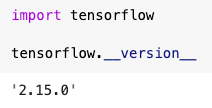

# 과제 6 수행 중 발생하는 문제 및 해결책 정리: keras_model.h5, Image.ANTIALIAS, df.append 관련

질문이라기보다 설명글입니다


강의 자료에서 사용하는 코드가 최신 버전의 라이브러리에서 제대로 동작하지 않는 경우가 있어서, 환경에 따라 버그가 발생할 수 있습니다.


문제되는 코드는 2번 문제의

```
model = load_model('keras_model.h5')
image = ImageOps.fit(image, size, Image.ANTIALIAS)
```
그리고 9번 문제의
```
df = df.append({'NAME': b[0], 'VALUE': b[1], 'COND': b[2]}, ignore_index=True)
df = df.append(df1, ignore_index=True)
```

형태의 코드들입니다.


\* 라이브러리의 버전들을 언급하게 될텐데, 라이브러리 버전은 스크린샷과 같이 코드를 입력해서 확인할 수 있습니다.


## 1. model = load_model('keras_model.h5') 실행 시 TypeError ~~ Exception Encountered 오류 발생

```
TypeError: Error when deserializing class 'DepthwiseConv2D' using config={'name': 'expanded_conv_depthwise', 'trainable': True, 'dtype': 'float32', 'kernel_size': [3, 3], 'strides': [1, 1], 'padding': 'same', 'data_format': 'channels_last', 'dilation_rate': [1, 1], 'groups': 1, 'activation': 'linear', 'use_bias': False, 'bias_initializer': {'class_name': 'Zeros', 'config': {}}, 'bias_regularizer': None, 'activity_regularizer': None, 'bias_constraint': None, 'depth_multiplier': 1, 'depthwise_initializer': {'class_name': 'VarianceScaling', 'config': {'scale': 1, 'mode': 'fan_avg', 'distribution': 'uniform', 'seed': None}}, 'depthwise_regularizer': None, 'depthwise_constraint': None}.

Exception encountered: Unrecognized keyword arguments passed to DepthwiseConv2D: {'groups': 1}
```


지금 텐서플로우에 케라스가 포함되는 상태로 배포되는데, 텐서플로우 2.16 버전이 릴리즈되면서 케라스 버전이 크게 바뀌었습니다.

* https://github.com/tensorflow/tensorflow/releases/tag/v2.16.0-rc0 의 Breaking Changes 참고


keras_model.h5는 이전 버전의 케라스에 대응하기 때문에 오류가 발생하는 것입니다.


해결 방법으로는


1. 위 링크의 설명대로 직접 케라스2를 설치하거나:
```
pip install tf-keras~=2.16
```


2. 이전 버전의 케라스를 갖고 있는 텐서플로우를 설치하거나:
```
pip install tensorflow==2.15.0
```


3. 텐서플로우 2.15.0이 기본 설치되어있는 구글 코랩을 사용하는 방법이 있습니다.

https://colab.research.google.com





## 2. image = ImageOps.fit(image, size, Image.ANTIALIAS) 실행 시 AttributeError 발생
```
AttributeError: module 'PIL.Image' has no attribute 'ANTIALIAS'
```


pillow 10.0.0이 릴리즈되면서 PIL.Image.ANTIALIAS가 삭제되었습니다.

https://pillow.readthedocs.io/en/stable/releasenotes/10.0.0.html#constants


해결 방법


1. 공식 문서에서 제시하는 대체 코드로 변경

`image = ImageOps.fit(image, size, Image.ANTIALIAS)` 코드를
`image = ImageOps.fit(image, size, Image.LANCZOS)` 코드로 변경합니다.


2. 이전 버전의 pillow로 재설치
```
pip install pillow~=9.5.0
```

3. pillow 9.4.0 이 설치되어있는 구글 코랩 사용

https://colab.research.google.com


## 3. df.append 실행 시 AttributeError 발생
```
AttributeError: 'DataFrame' object has no attribute 'append'
```


pandas 2.0.0이 릴리즈되면서 append가 삭제되었습니다.

https://pandas.pydata.org/docs/whatsnew/v2.0.0.html#removal-of-prior-version-deprecations-changes


1. 대신 df.concat 사용

`df = df.append({'NAME': b[0], 'VALUE': b[1], 'COND': b[2]}, ignore_index=True)`  코드를
`df = pd.concat([df, pd.DataFrame([{'NAME': b[0], 'VALUE': b[1], 'COND': b[2]}])], ignore_index=True)`  코드로,

`df = df.append(df1, ignore_index=True)`  코드를
`df = pd.concat([df, df1], ignore_index=True)`  코드로 변경합니다.


2. 이전 버전의 pandas로 재설치
```
pip install pandas~=1.5.3
```

* 구글 코랩은 pandas 2.0.3이 기본 설치되어있으므로, 코랩을 사용하더라도 추가 작업이 필요합니다.


과제 수행하면서 도움 되시길 바라겠습니다.
