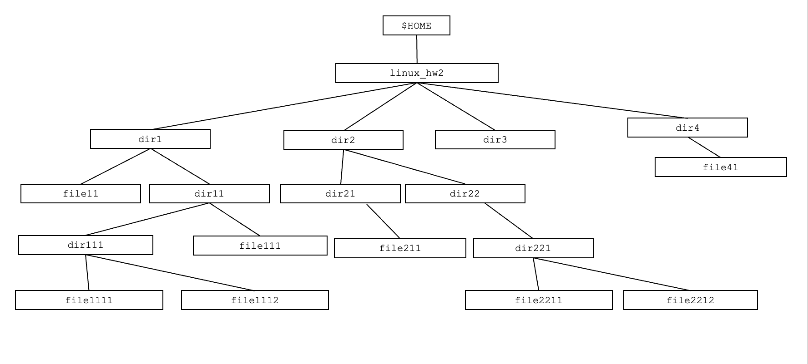
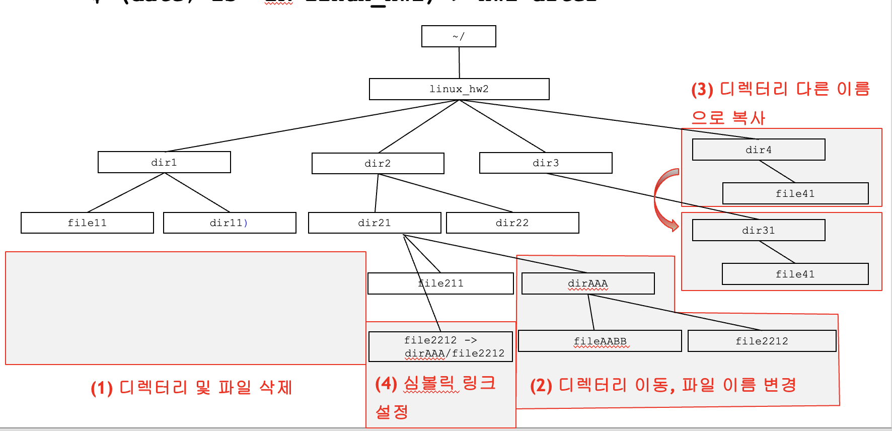

1. 자신의 HOME 디렉터리 내에서 다음과 같은 구조의 디렉터리와 파일을 생성한 후 홈 디렉터리에서 다음의 명령을 수행하시오.
단, 파일은 /etc/hosts라는 파일을 다음과 같은 구조에 맞게 복사하여 구성하여야 한다. 
`$(date; ls –lR linux_hw2) > hw2-before`

2. 다음 네 가지 기능(디렉터리 및 파일 삭제, 디렉터리 이동 및 파일 이름 변경, 디렉터리 다른 이름으로 복사, 심볼릭 링크 설정)을 수행한 후 다음 명령을 실행하시오. 
`$ (date; ls –lR linux_hw2) > hw2-after`

3. 2번의 디렉터리와 파일에 대해 3번의 네 가지 기능이 수행된 결과를 얻기 위해 순서대로 타이핑한 명령어를 캡쳐하여 hw2-commands라는 이름의 파일에 저장하시오.
4. hw2-before, hw2-after, hw2-commands라는 3개 파일을 e-class에 각각 제출하시오. 
