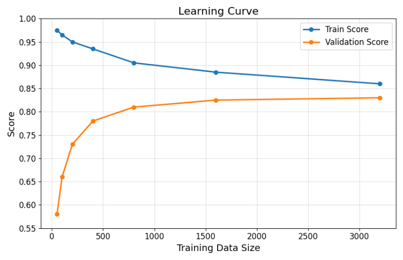

# AI・推理・データサイエンス II 期末レポート
# AI·수리·데이터사이언스 II 기말

### 1. 第1次AIブームの中心テーマはどれですか？
### 1. 제1차 AI 붐의 중심 테마는 어느 것입니까?

- 推論・探索による問題解決  
    추론・탐색을 통한 문제 해결
- エキスパートシステムによる知識表現  
    전문가 시스템을 통한 지식 표현
- 大規模データを用いた統計的学習  
    대규모 데이터를 이용한 통계적 학습
- ルールベースに基づいた自然言語による対話システム  
    규칙 기반의 자연어 대화 시스템
- ニューラルネットワークによる深層学習
    신경망에 의한 심층 학습
- AIを使った人件費の削減  
    AI를 이용한 인건비 절감

**回答 :**
- 推論・探索による問題解決  
    추론·탐색을 통한 문제 해결

### 2. 以下の記述のうち「オントロジー」の説明として最も適した選択肢を選んでください．
### 2. 다음 설명 중 "온톨로지"의 설명으로 가장 적합한 선택지를 선택하세요.

- ニューラルネットワークの層を表現する構造  
    신경망의 층을 표현하는 구조
- 人工知能の推論アルゴリズムそのもの  
    인공지능의 추론 알고리즘 그 자체
- 概念間の関係を体系的に整理した知識表現
    개념 간의 관계를 체계적으로 정리한 지식 표현
- 確率的にデータを生成するための統計モデル  
    확률적으로 데이터를 생성하기 위한 통계 모델
- コンピュータが探索空間を効率化するためのヒューリスティック  
    컴퓨터가 탐색 공간을 효율화하기 위한 휴리스틱
- 大規模データから自動的に特徴を抽出するアルゴリズム  
    대규모 데이터에서 자동으로 특징을 추출하는 알고리즘

**回答 :**
- 概念間の関係を体系的に整理した知識表現  
    개념 간의 관계를 체계적으로 정리한 지식 표현

### 3. 次の説明のうち，標本化に関する記述として「正しいものをすべて選択」してください．
### 3. 다음 설명 중 표본화에 관한 설명으로 "올바른 것 모두 선택"하세요.

- アナログ音声の信号を一定時間間隔で取り出す作業を標本化という．  
    아날로그 음성 신호를 일정 시간 간격으로 추출하는 작업을 표본화라고 한다.
- 連続な波の振幅を有限の振幅で近似する作業を標本化という．  
    연속적인 파동의 진폭을 유한한 진폭으로 근사하는 작업을 표본화라고 한다.
- 有限な波の振幅を2進数で表記する作業を標本化という．  
    유한한 파동의 진폭을 2진수로 표기하는 작업을 표본화라고 한다.
- 標本化はアナログ音声のデータを圧縮するために使われるので，データ量が増えても構わないのであれば標本化せずにアナログ音声をデジタル化できる．  
    표본화는 아날로그 음성 데이터를 압축하기 위해 사용되므로, 데이터 양이 늘어나도 상관없다면 표본화하지 않고 아날로그 음성을 디지털화할 수 있다.
- 連続的な光の強さ(光強度分布)を離散的な格子点(画素)で取り出す作業を標本化という．  
    연속적인 빛의 세기(광강도 분포)를 이산적인 격자점(화소)으로 추출하는 작업을 표본화라고 한다.
- 各素性データの平均を0，分散を1にする変数変換を標本化という．  
    각 특성 데이터의 평균을 0, 분산을 1로 하는 변수 변환을 표본화라고 한다.
- 上の選択肢はすべて標本化の記述として正しくない．  
    위 선택지는 모두 표본화의 설명으로 올바르지 않다.

**回答 :**
- アナログ音声の信号を一定時間間隔で取り出す作業を標本化という．  
    아날로그 음성 신호를 일정 시간 간격으로 추출하는 작업을 표본화라고 한다.
- 連続的な光の強さ(光強度分布)を離散的な格子点(画素)で取り出す作業を標本化という．  
    연속적인 빛의 세기(광강도 분포)를 이산적인 격자점(화소)으로 추출하는 작업을 표본화라고 한다.

### 4. 次の条件でアナログ音声をデジタル化したときのデータ量(bit)を求めてください．
### 4. 다음 조건에서 아날로그 음성을 디지털화했을 때의 데이터 양(bit)을 구하세요.

- サンプリング周波数：44.1 kHz  
    샘플링 주파수: 44.1 kHz
- 量子化ビット数：16 bit  
    양자화 비트 수: 16 bit
- チャンネル数：2 (ステレオ)   
    채널 수: 2 (스테레오)
- 録音時間：5 分間   
    녹음 시간: 5분간

**回答 :**
- 423360000  

$$
44.1 \text{ kHz} \times 16 \text{ bit} \times 2 \times 5 \text{ 分} \times 60 \text{ 秒} = 423,360,000 \text{ bit}
$$

### 5. 次のうち，佐賀大学が学生向けに公表した「教育・学修におけるChatGPT等の生成AI利用について」（2023年7月4日）の内容として「正しいものをすべて選択」してください．
### 5. 다음 중 사가대학이 학생을 대상으로 공표한 "교육·학습에서 ChatGPT 등의 생성AI 이용에 대하여"(2023년 7월 4일)의 내용으로 "올바른 것 모두 선택"하세요.

- 生成AIは適切に使えば有用なツールであり，学生は積極的に活用してよいと大学が明言している．  
    생성AI는 적절히 사용하면 유용한 도구이며, 학생은 적극적으로 활용해도 좋다고 대학이 명언하고 있다.
- レポート・学位論文・ラーニングポートフォリオなどは学生本人が作成することを前提とするため，生成AI出力をそのまま使用してはならない．  
    레포트·학위논문·러닝포트폴리오 등은 학생 본인이 작성하는 것을 전제로 하므로, 생성AI 출력을 그대로 사용해서는 안 된다.
- 生成AIの出力内容は常に正確であるため，確認作業は不要とされている．  
    생성AI의 출력 내용은 항상 정확하므로, 확인 작업은 불필요하다고 되어 있다.
- 機密情報・個人情報などを生成AIに入力すると漏えいの危険があるため，入力しないよう注意が促されている．  
    기밀정보·개인정보 등을 생성AI에 입력하면 누출 위험이 있으므로, 입력하지 않도록 주의가 촉구되고 있다.
- 生成AIの使用可否は授業ごとに異なり，担当教員の指示に従う必要がある．  
    생성 AI의 사용 가능 여부는 수업마다 다르며, 담당 교원의 지시에 따를 필요가 있다.
- 生成AIを提供している企業は著作権を侵害していないので，生成AIの生成物は著作権を気にせず自由に利用してよいとされている．  
    생성 AI를 제공하는 기업은 저작권을 침해하지 않으므로, 생성AI의 생성물은 저작권을 신경 쓰지 않고 자유롭게 이용해도 좋다고 되어 있다.

**回答 :**
- レポート・学位論文・ラーニングポートフォリオなどは学生本人が作成することを前提とするため，生成AI出力をそのまま使用してはならない．  
    레포트·학위논문·러닝포트폴리오 등은 학생 본인이 작성하는 것을 전제로 하므로, 생성AI 출력을 그대로 사용해서는 안 된다.
- 機密情報・個人情報などを生成AIに入力すると漏えいの危険があるため，入力しないよう注意が促されている．  
    기밀정보·개인정보 등을 생성AI에 입력하면 누출 위험이 있으므로, 입력하지 않도록 주의가 촉구되고 있다.
- 生成AIの使用可否は授業ごとに異なり，担当教員の指示に従う必要がある．  
    생성 AI의 사용 가능 여부는 수업마다 다르며, 담당 교원의 지시에 따를 필요가 있다.

### 6. カテゴリが非常に多い質的変数の素性に対してワン・ホット・エンコーディングを行うとどうなりますか？次の記述の中から最も適切な回答を1つ選択してください．
### 6. 카테고리가 매우 많은 질적 변수의 특성에 대해 원-핫 인코딩을 수행하면 어떻게 됩니까? 다음 설명 중 가장 적절한 답변을 1개 선택하세요.

- カテゴリが自然に連続になり，汎化性能が上がりやすい．  
    카테고리가 자연스럽게 연속이 되어, 일반화 성능이 올라가기 쉽다.
- カテゴリ間に距離の概念が導入される．  
    카테고리 간에 거리의 개념이 도입된다.
- カテゴリ間の距離が適切に反映される．  
    카테고리 간의 거리가 적절하게 반영된다.
- 外れ値の影響が大きくなる．  
    이상치의 영향이 커진다.
- 外れ値の影響が小さくなる．  
    이상치의 영향이 작아진다.
- 次元の呪いによって学習が困難になる．  
    차원의 저주로 인해 학습이 어려워진다.

**回答 :**
- 次元の呪いによって学習が困難になる．  
    차원의 저주로 인해 학습이 어려워진다.

### 7. ある2値分類器の混同行列は添付画像のようになりました． このモデルの再現率(Recall)を求めてください． なお，解答欄には半角数字の小数点数で入力してください．
### 7. 어떤 2진 분류기의 혼동 행렬은 첨부 이미지와 같습니다. 이 모델의 재현율(Recall)을 구하세요. 단, 답안란에는 반각 숫자의 소수점 수로 입력하세요.

<table>
<tbody>
    <tr>
        <th></th>
        <th>
            予測クラスが + 1  
            예측 클래스가 + 1
        </th>
        <th>
            予測クラスが - 1  
            예측 클래스가 - 1
        </th>
    </tr>
    <tr>
        <th>
            真のクラスが + 1  
            진짜 클래스가 + 1
        </th>
        <td>144</td>
        <td>56</td>
    </tr>
    <tr>
        <th>
            真のクラスが - 1  
            진짜 클래스가 - 1
        </th>
        <td>18</td>
        <td>282</td>
    </tr>
</tbody>
</table>

**回答 :**
- 0.72

$$
\text{Recall} = \frac{TP}{TP + FN} = \frac{144}{144 + 56} = 0.72
$$

### 8. ある分類器の学習曲線を描いたところ，添付の画像になりました．このモデルの汎化性能を上げるにはどうすればよいですか？下記の選択肢の中から最も効果が大きいと思われる項目を1つ選択してください．
### 8. 어떤 분류기의 학습 곡선을 그렸더니 첨부 이미지가 되었습니다. 이 모델의 일반화 성능을 높이려면 어떻게 해야 합니까? 아래 선택지 중에서 가장 효과가 클 것으로 생각되는 항목을 1개 선택하세요.

  

- 学習データを増やす．
    학습 데이터를 늘린다.
- 学習データを減らす．
    학습 데이터를 줄인다.
- 前処理としてデータの標準化を行う．
    전처리로서 데이터의 표준화를 수행한다.
- 前処理を行わず，生データを学習する．
    전처리를 하지 않고, 원시 데이터를 학습한다.
- モデルの表現力を上げるようにハイパーパラメータを調整する．
    모델의 표현력을 높이도록 하이퍼파라미터를 조정한다.
- モデルの表現力を下げるようにハイパーパラメータを調整する．
    모델의 표현력을 낮추도록 하이퍼파라미터를 조정한다.

**回答 :**
- モデルの表現力を下げるようにハイパーパラメータを調整する．  
    모델의 표현력을 낮추도록 하이퍼파라미터를 조정한다.

주어진 그래프는 과적합 상황에서 확인 가능한 전형적인 학습 곡선이다. 이들 그래프에서, 훈련 데이터에 대한 점수는 매우 높지만, 검증 데이터에 대한 점수는 낮은 상태로 나타난다.

### 9. スマホの使用パターンから，バッテリー残量を予測する，次のモデルを考えます．
### 9. 스마트폰의 사용 패턴에서 배터리 잔량을 예측하는 다음 모델을 생각합니다.

素性 속성
- 直近1時間の画面点灯時間(分)  
    직전 1시간의 화면 점등 시간(분)
- 画面の平均輝度(0〜1の連続値)  
    화면의 평균 밝기(0~1의 연속값)
- CPU平均負荷(%)  
    CPU 평균 부하(%)
- 現在のバッテリー残量(%)  
    현재 배터리 잔량(%)

目的変数 목적변수
- 1時間後のバッテリー残量(%)  
    1시간 후의 배터리 잔량(%)

이하의 scikit-learn 함수 중에서 이 모델로 이용할 수 있는 것을 "모두 선택"하세요.  
以下の scikit-learn の関数のうち，このモデルとして利用できるものを「すべて選択」してください．  

- `sklearn.decomposition.PCA`
- `sklearn.cluster.KMeans`
- `sklearn.tree.DecisionTreeClassifier`
- `sklearn.tree.DecisionTreeRegressor`
- `sklearn.linear_model.LinearRegression`
- `sklearn.linear_model.LogisticRegression`

**回答 :**
- `sklearn.tree.DecisionTreeRegressor`
- `sklearn.linear_model.LinearRegression`

### 10. 以下のニューラルネットワークおよび sklearn.neural_network.MLPRegressor のハイパーパラメータに関する記述のうち，「正しいものをすべて選択」してください．。
### 10. 다음 신경망 및 sklearn.neural_network.MLPRegressor의 하이퍼파라미터에 관한 설명 중 "올바른 것 모두 선택"하세요.

- `hidden_layer_sizes=(100,50)` は隠れ層が2つあり，各層のニューロン数がそれぞれ 100, 50 を意味する．  
    `hidden_layer_sizes=(100,50)`는 은닉층이 2개 있으며, 각 층의 뉴런 수가 각각 100, 50을 의미한다.
- ニューラルネットワークでは層が深いほど常に性能が高くなるため，`hidden_layer_sizes` に多くの層を指定するほど良い．  
    신경망에서는 층이 깊을수록 항상 성능이 높아지므로, `hidden_layer_sizes`에 많은 층을 지정할수록 좋다.
- `activation="relu"` を選択すると，勾配消失が起こりにくく深いネットワークの学習も安定しやすい．  
    `activation="relu"`를 선택하면, 기울기 소실이 일어나기 어렵고 깊은 네트워크의 학습도 안정되기 쉽다.
- 回帰モデルでは `activation="logistic"` を選ぶのが一般的である．  
    회귀 모델에서는 `activation="logistic"`을 선택하는 것이 일반적이다.
- `learning_rate_init` は勾配降下法での学習率を決めるパラメータであり，大きすぎると損失が発散することがある．  
    `learning_rate_init`는 경사 하강법에서의 학습률을 결정하는 파라미터이며, 너무 크면 손실이 발산할 수 있다.
- 素性データのスケールは MLP の学習に影響しないので，前処理として標準化や正規化を使う必要はない．  
    특성 데이터의 스케일은 MLP의 학습에 영향을 미치지 않으므로, 전처리로서 표준화나 정규화를 사용할 필요는 없다.

**回答 :**
- `hidden_layer_sizes=(100,50)` は隠れ層が2つあり，各層のニューロン数がそれぞれ 100, 50 を意味する．  
    `hidden_layer_sizes=(100,50)`는 은닉층이 2개 있으며, 각 층의 뉴런 수가 각각 100, 50을 의미한다.
- `activation="relu"` を選択すると，勾配消失が起こりにくく深いネットワークの学習も安定しやすい．  
    `activation="relu"`를 선택하면, 기울기 소실이 일어나기 어렵고 깊은 네트워크의 학습도 안정되기 쉽다.
- `learning_rate_init` は勾配降下法での学習率を決めるパラメータであり，大きすぎると損失が発散することがある．  
    `learning_rate_init`는 경사 하강법에서의 학습률을 결정하는 파라미터이며, 너무 크면 손실이 발산할 수 있다.
- 素性データのスケールは MLP の学習に影響しないので，前処理として標準化や正規化を使う必要はない．  
    특성 데이터의 스케일은 MLP의 학습에 영향을 미치지 않으므로, 전처리로서 표준화나 정규화를 사용할 필요는 없다.

## プログラムを作成して次の小問に回答してください．
## 프로그램을 작성하여 다음 소문제에 답변하세요.

AI・数理・データサイエンスII のチームの「共有済み」(いつも講義資料をアップロードしているところ) に「train_cafe.csv」ファイルと「prob_cafe.csv」ファイルがアップロードされています．これらのファイルをダウンロードし，Python で読み込んでください．なお，これらのファイルは UTF8 でエンコードされた CSV ファイルです．  
AI·수리·데이터사이언스II 팀의 "공유됨"(항상 강의 자료를 업로드하는 곳)에 "train_cafe.csv" 파일과 "prob_cafe.csv" 파일이 업로드되어 있습니다. 이들 파일을 다운로드하여 Python으로 읽어주세요. 이들 파일은 UTF8로 인코딩된 CSV 파일입니다.

「train_cafe.csv」は毎日，学食で昼食を食べている学生が何を注文したかの(架空の)データです．  
"train_cafe.csv"는 매일, 학식에서 점심을 먹는 학생이 무엇을 주문했는지의 (가상의) 데이터입니다.

各素性は次の意味を持ちます．
각 특성은 다음과 같은 의미를 가집니다.
- 曜日：今日の曜日を表します． {月, 火, 水, 木, 金} の5クラスあります．  
    요일: 오늘의 요일을 나타냅니다. {월, 화, 수, 목, 금}의 5클래스가 있습니다.
- 前日メニュー：前日の昼食に何を食べたかを表します． {定食, 丼・カレー, 麺類, 前日不明} の4クラスあります．前日不明は前日に学食で昼食を食べていない，もしくは，前日に食べたメニューを忘れたことを表します．  
    전일 메뉴: 전날 점심에 무엇을 먹었는지를 나타냅니다. {정식, 덮밥·카레, 면류, 전일 불명}의 4클래스가 있습니다. 전일 불명은 전날 학식에서 점심을 먹지 않았거나, 전날 먹은 메뉴를 잊은 것을 나타냅니다.
- 空席率：学食の空席率を表します． 0 から 1 までの小数です．なお，「欠損値」があります．  
    공석률: 학식의 공석률을 나타냅니다. 0부터 1까지의 소수입니다. 단, "결측치"가 있습니다.
- 残り時間：学食に到着した時点での昼休みの残り時間(分)を表します．20 から 60 までの整数です．  
    남은 시간: 학식에 도착한 시점에서의 점심시간의 남은 시간(분)을 나타냅니다. 20부터 60까지의 정수입니다.
- おすすめ：学食の入口に貼ってあった今日のおすすめメニューを表します． {定食, 丼・カレー, 麺類} の3クラスあります．  
    추천: 학식 입구에 붙어 있던 오늘의 추천 메뉴를 나타냅니다. {정식, 덮밥·카레, 면류}의 3클래스가 있습니다.
- メニュー：今日は何を注文したかを表します． {定食, 丼・カレー, 麺類} の3クラスあります．  
    메뉴: 오늘 무엇을 주문했는지를 나타냅니다. {정식, 덮밥·카레, 면류}의 3클래스가 있습니다.

「prob_cafe.csv」には上記のメニュー以外が含まれています．メニューが目的変数です．  
"prob_cafe.csv"에는 위의 메뉴 이외가 포함되어 있습니다. 메뉴가 목적 변수입니다.

### 11. 前処理  
### 11. 전처리

「train_cafe.csv」と「prob_cafe.csv」を読み込み，質的データに対しては次のラベルエンコーディングを行います．  
「train_cafe.csv」와 「prob_cafe.csv」를 읽어들여, 질적 데이터에 대해서는 다음의 라벨 인코딩을 수행합니다.

「月→0」, 「火→1」, 「水→2」, 「木→3」, 「金→4」
「定食→0」, 「丼・カレー→1」, 「麺類→2」, 「前日不明→3」

その後，空席率の欠損値は中央値で埋めます．  
그 후, 공석률의 결측치는 중앙값으로 채웁니다.

欠損値を埋めた中央値の値を回答してください．  
결측치를 채운 중앙값의 값을 답변하세요.

### 12.ハイパーパラメータ探索
### 12. 하이퍼파라미터 탐색

(10점)
次をプログラミングしてください．
モデルはランダムフォレストを使います．
ランダムフォレストのハイパーパラメータは n_estimators=401 を固定し，max_depth と min_samples_leaf をグリッドサーチの対象とします．それ以外のハイパーパラメータはデフォルトを使用します．
max_depth は [2, 4, 8, 16, 32] を，min_samples_leaf は [1, 5, 10] をグリッドサーチし，正解率が最も高いモデルを探します．なお，交差検証は5回とします．
このとき，最良モデルの検証スコアが入る階級を選んでください．
なお，ランダムフォレストは乱数を使うので実行する度に結果が変わります．どの階級に入るか迷った場合は何度かプログラムを実行し，最も確信が高い階級を選択しましょう．

0.65 未満

0.65 以上 0.70 未満

0.70 以上 0.75 未満

0.75 以上 0.80 未満

0.80 以上 0.85 未満

0.85 以上 0.90 未満

0.90 以上 0.95 未満

0.95 以上 1.0 以下
13
この予測モデルにおいて，素性重要度が最も高い素性と，2番目に高い素性の「2つを選択」してください．
(5점)

曜日

前日メニュー

空席率

残り時間

おすすめ
14
未知データの予測
(5점)
「prob_cafe.csv」のメニューを予測し，「定食」が予測された回数を回答してください．

