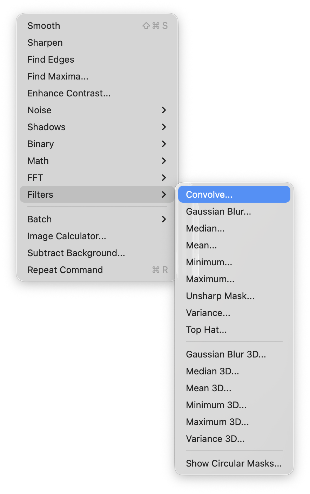
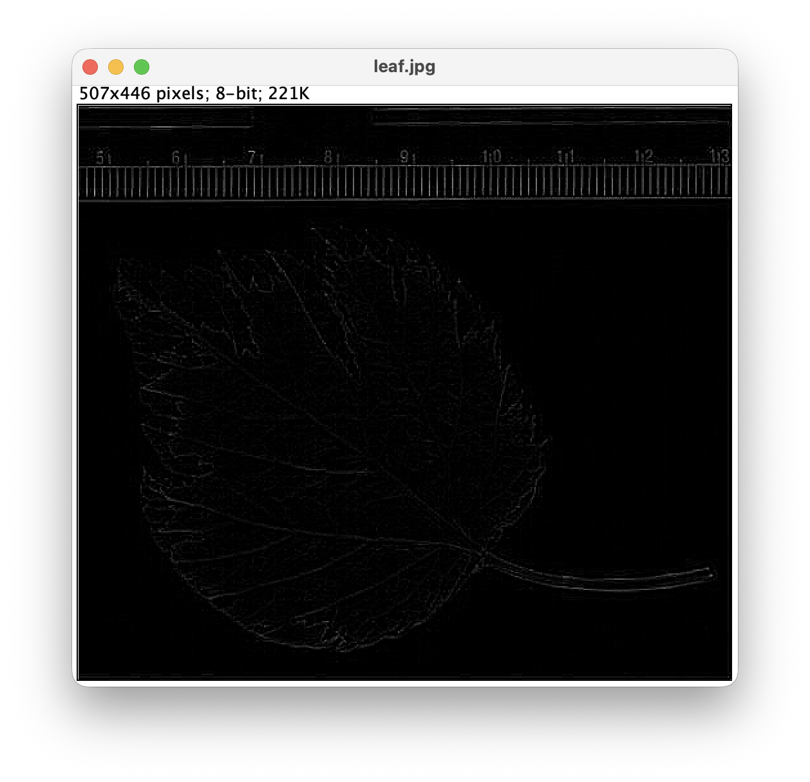

# 2025년도 「화상 정보 처리」 레포트 과제 (PDF 내용)

**제출 기한:** 2026년 2월 14일 (금) 오후 5시
**제출 장소:** Teams 채팅 (okumurah) 또는 아래 업로드 사이트
[http://prof-okumura.sakura.ne.jp/UPLOADER/indexJ.html](http://prof-okumura.sakura.ne.jp/UPLOADER/indexJ.html)

**수리 조건:**
*   기한 내에 제출할 것.
*   과제 내용, 처리 과정, 결과 등을 독자가 알 수 있도록 기술할 것.
*   PDF 또는 Microsoft docx 형식 중 하나로 제출 가능.
*   영어 또는 일본어 중 선택 가능. (우수한 영문 레포트의 경우 가산점 부여)
*   상의는 권장하지만, 타인의 레포트를 그대로 베끼거나 옮겨 적는 행위는 엄격히 금지함.
*   참고한 문헌, 서적, 웹페이지는 반드시 명시할 것.

#### 【과제 1】 (필수)
(1) NIH ImageJ와 플러그인 FFTJ를 사용하여, 다음과 같은 다양한 이미지의 2차원 FFT와 DC 성분을 중심으로 이동시키기 위한 시프트(Shift) 처리를 수행하고, 파워 스펙트럼 또는 진폭 스펙트럼(2차원 이미지 형태)을 구하십시오. (Teams에 이미지 파일이 준비되어 있습니다.)
*   줄무늬 방향은 동일하고 간격이 다른 이미지
*   줄무늬 방향이 다른 이미지
*   평균값이 다른 이미지

(2) 진폭 스펙트럼 또는 파워 스펙트럼 이미지의 각 부분이 무엇을 표현하는지 (1)의 처리 결과를 바탕으로 설명하십시오.
① 스펙트럼 중심 (원점)
② 원점에 가까운 영역
③ 원점에서 먼 영역
④ 원점으로부터의 방향

#### 【과제 2】 (필수)
(1) 그레이스케일 이미지를 직접 작성하거나 다운로드 등을 통해 준비하십시오. (URL 명시 필수) 단, 이미지는 (4)에서 특징 추출을 수행했을 때 그 효과를 확인할 수 있는 것이어야 합니다.
(2) 수업 중에 배운 내용이나 인터넷 등을 조사하여, '특정한 효과가 있는' 필터 크기 3×3의 공간 필터를 하나 선택하고, 그 필터 계수와 예상되는 효과를 기술하십시오.
(3) (2)에서 선택한 필터의 2차원 이산 푸리에 변환(DFT)을 수행하여 주파수 진폭 스펙트럼을 계산하십시오. (계산은 수기 또는 Python 모두 가능)

```py
>>> import numpy as np
>>> a = np.array([[1, 2, 3],
...               [4, 5, 6],
...               [7, 8, 9]])
>>> b = np.fft.fftshift(np.fft.fft2(a))
>>> b
array([[  0. +0.j        , -13.5-7.79422863j,   0. +0.j        ],
       [ -4.5-2.59807621j,  45. +0.j        ,  -4.5+2.59807621j],
       [  0. +0.j        , -13.5+7.79422863j,   0. +0.j        ]])
>>> c = np.abs(b)
>>> c
array([[ 0.        , 15.58845727,  0.        ],
       [ 5.19615242, 45.        ,  5.19615242],
       [ 0.        , 15.58845727,  0.        ]])
```

(4) NIH ImageJ의 Convolve 필터를 사용하여, (2)의 필터와 (1)의 이미지를 합성곱(Convolution) 연산하고, 결과 이미지를 제시함과 동시에 결과 이미지의 어느 부분에 (2)에서 예상한 효과가 나타났는지 고찰하십시오.

  



```
0 1 0
1 -4 1
0 1 0
```

#### 【과제 3】 (필수)
잡지 등에 게재되는 '틀린 그림 찾기' 문제를 디지털카메라나 이미지 스캐너로 디지털화하여, 컴퓨터로 자동 해결하려면 어떤 처리를 하면 좋을지 그 알고리즘을 설명하십시오.

#### 【과제 4】 (필수)
최근 이미지를 이용한 시스템이 많이 활용되고 있습니다. 예를 들어:
*   공항에서의 얼굴 인증을 통한 출입국 심사
*   열화상 카메라(서모그래피)를 통한 입국 예정자의 건강 상태 파악
*   스마트폰이나 은행 ATM에서의 지문 인증을 통한 본인 확인
*   어라운드 뷰 모니터로 대표되는 자동차 주변 조망
등 다양한 업종과 용도로 이용되고 있습니다. 현재 상품화되어 있는 이러한 시스템 중 한 종류를 선택하여, 인터넷 등을 통해 그 원리와 장점, 그리고 여러분이 생각하는 문제점(단점)을 설명하십시오. (참고한 웹페이지 URL 등은 반드시 명시하십시오. 무단 인용 시 저작권 침해가 될 수 있으니 주의하십시오.)

**===== 여기까지 만점 시 89점 (성적 '우(優)' 확정) =====**

#### 【과제 5】 ('수(秀)' 성적을 위한 도전 과제)
정지 영상이나 동영상을 사용하여 오리지널 작품을 만드십시오.
**《예시》**
*   자체 제작 또는 공개된 모핑(Morphing) 소프트웨어를 사용하여(가능한 한 크로스 디졸브뿐만 아니라 워핑도 포함), 이미지 A에서 이미지 B로 부드럽게 변화하는 모핑 이미지 제작. (zip 압축 후 전용 사이트에 제출)
*   Python이나 OpenCV를 이용한 이미지 응용 시스템 제작. 소스 파일을 제출하고 시스템 개요 등을 설명하십시오. (예: 카메라 속 얼굴 표정에 맞춰 캐릭터의 표정도 변하는 Vtuber 스타일 시스템 등)
*   크로마키 작품 제작 (그린 스크린 대여 가능)
*   수 초 정도의 테마가 있는 사이런트(무음) 동영상 작품 제작.

파일 형식은 원칙적으로 mp4, mkv, 애니메이션 GIF, 애니메이션 PNG 중 하나로 하십시오. (zip 압축 후 업로드 사이트에 제출)

모핑 두 단계로 해야 잘 움직임
- 대응점을 설정하는 소프트
- 파이썬 opencv를 써서 자신의 표정을 캐릭터의 표정으로 바꾸는 시스템


크로스 모핑
각 이미지의 색상 변화에 대해서 처리
좌측 노란색 원 -> 우측 파란색 마름모
좌측 노란색 원이 점점 사라짐 (색은 파란색으로 변함)
우측 파란색 마름모가 점점 나타남

워핑
좌측 노란색 원이 우측 파란색 마름모로 형태가 변함
좌측의 원이 이동하면서 점점 마름모 형태로 변함
가능한 이것이 되는 소프트를 찾아라


